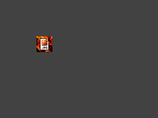
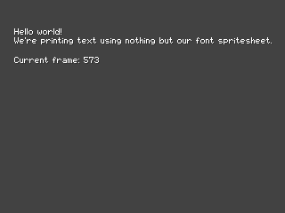
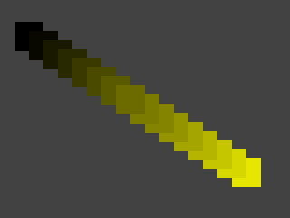
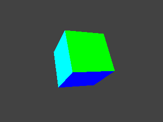

# PlayStation 1 bare-metal C examples

This repository contains a series of homebrew tutorials and well-commented
examples for the original Sony PlayStation, built using no external SDKs or
tools other than an up-to-date, unmodified GCC toolchain targeting the MIPS
architecture, CMake as the build system and some Python scripts.

The following examples are currently available:

| #   | Screenshot                                                                    | Description                                                                       |
| --: | :---------------------------------------------------------------------------- | :-------------------------------------------------------------------------------- |
|   0 |                                                                               | [Printing "hello world" over the serial port](src/00_helloWorld/main.c)           |
|   1 |  | [Initializing the GPU and drawing basic graphics](src/01_basicGraphics/main.c)    |
|   2 |   | [Adding double buffering and animated graphics](src/02_doubleBuffer/main.c)       |
|   3 |       | [Improving GPU drawing efficiency using DMA chains](src/03_dmaChain/main.c)       |
|   4 |       | [Uploading a texture to VRAM and using it](src/04_textures/main.c)                |
|   5 |       | [Using indexed color textures and color palettes](src/05_palettes/main.c)         |
|   6 |          | [Implementing spritesheets and simple font rendering](src/06_fonts/main.c)        |
|   7 |  | [Using ordering tables to control GPU drawing order](src/07_orderingTable/main.c) |
|   8 |   | [Drawing a 3D spinning cube using the GTE](src/08_spinningCube/main.c)            |
|   9 |    | [Getting input from connected controllers](src/09_controllers/main.c)             |

New examples showing how to make use of more hardware features will be added
over time.

## Building the examples

### Installing dependencies

The following dependencies are required in order to compile the examples:

- CMake 3.25 or later;
- Python 3.10 or later;
- [Ninja](https://ninja-build.org/);
- a recent GCC toolchain configured for the `mipsel-none-elf` target triplet
  (toolchains targeting `mipsel-linux-gnu` will generally work as well, but are
  not recommended as the ones available in most distros' package managers tend
  to be outdated or configured improperly).

The toolchain can be installed on Windows through
[the `mips` script from the pcsx-redux project](https://github.com/grumpycoders/pcsx-redux/tree/main/src/mips/psyqo/GETTING_STARTED.md#windows),
on macOS using
[Homebrew](https://github.com/grumpycoders/pcsx-redux/tree/main/src/mips/psyqo/GETTING_STARTED.md#macos)
or on Linux by
[spawning it from source](https://github.com/grumpycoders/pcsx-redux/blob/main/tools/linux-mips/spawn-compiler.sh),
and should be added to your `PATH` environment variable in order to let CMake
find it. If you have any of the open-source PS1 SDKs installed there is a good
chance you already have a suitable toolchain set up (try running
`mipsel-none-elf-gcc` and `mipsel-linux-gnu-gcc` in a terminal). The other
dependencies can be obtained through a package manager.

The Python scripts require a few additional dependencies, which can be installed
in a virtual environment by running the following commands from the root
directory of the repository:

```bash
# Windows (using PowerShell)
py -m venv env
env\Scripts\Activate.ps1
py -m pip install -r tools\requirements.txt

# Windows (using Cygwin/MSys2), Linux or macOS
python3 -m venv env
source env/bin/activate
pip3 install -r tools/requirements.txt
```

### Building with an IDE

Many IDEs and text editors feature out-of-the-box support for CMake, so you
should be able to import the repo into your IDE of choice and immediately get a
working "build" button once the toolchain is set up. If you are using VS Code,
installing the
[CMake Tools](https://marketplace.visualstudio.com/items?itemName=ms-vscode.cmake-tools)
and [clangd](https://clangd.llvm.org) extensions for build integration as well
as context-sensitive suggestions is highly recommended.

If the toolchain is not listed in your `PATH` environment variable, you will
have to set the `TOOLCHAIN_PATH` CMake variable to the full path to your
toolchain's `bin` subdirectory (e.g. `/opt/mipsel-linux-gnu/bin`) using your
IDE's CMake cache editor. See your IDE's documentation for information on
accessing the cache editor; in VS Code with the CMake Tools extension, the
editor can be opened by selecting "Edit CMake Cache (UI)" from the command
palette (Ctrl+Shift+P).

### Building from the command line

If you cannot use an IDE or prefer working from the command line, simply run
these two commands from the repository's root:

```bash
cmake --preset debug
cmake --build build
```

If you are unfamiliar with CMake, the first command is what's known as the
*configure command* and prepares the build directory for the second command,
which actually runs the compiler and generates the executables. Once the build
directory is prepared you'll no longer have to run the configure command unless
you edit the CMake scripts to e.g. add new examples or source files.

You may replace `debug` with `release` to enable release mode, which will turn
on additional compiler optimizations, remove assertions and produce smaller
binaries. Replacing it with `min-size-release` will further optimize the
executables for size at the expense of performance.

If the toolchain is not listed in your `PATH` environment variable, you will
have to pass the path to its `bin` subdirectory to the configure command via the
`-DTOOLCHAIN_PATH` option, like this:

```bash
cmake --preset debug -DTOOLCHAIN_PATH=/opt/mipsel-linux-gnu/bin
```

### Floating point support

The PlayStation does not have a floating point unit. While GCC can still provide
support for floats through emulation, some prebuilt versions of the
`mipsel-none-elf` and `mipsel-linux-gnu` toolchains ship with floating point
emulation partially or fully disabled at build time. For this reason, the build
scripts do not explicitly enable it.

If you have a toolchain known to have full support for software floating point
(e.g. one you built yourself with the appropriate options) but that does not
have it enabled by default, you may force it by adding the following line to
`CMakeLists.txt`:

```cmake
target_compile_options(flags INTERFACE -msoft-float)
```

Keep in mind that software floats are particularly slow, code-heavy and shall be
avoided at all costs. The included printf library has been modified to disable
the `%f` specifier, regardless of whether the toolchain supports software
floats, in order to reduce code size.

## Running the examples

### Using an emulator

The build scripts will compile each example into a `.psexe` file. This is the
PS1 BIOS's native executable format and is also supported by pretty much every
PS1 emulator, making it straightforward to run the examples through emulation.
The following emulators are recommended for development work:

- [DuckStation](https://github.com/stenzek/duckstation);
- [PCSX-Redux](https://github.com/grumpycoders/pcsx-redux) (not to be confused
  with PCSX-R), somewhat less accurate but comes with extensive debugging tools
  and scripting support.

Note that both DuckStation and Redux default to using a dynamic recompiler
(dynarec) in order to boost performance at the cost of accuracy. The dynarec is
incompatible with either emulator's debugger and can be prone to timing issues;
it's thus recommended to disable it and switch to interpreted CPU mode instead.

Using other emulators is strongly discouraged as more or less all of them are
outdated and known to be inaccurate. In particular, **the emulators listed**
**below are broken in many ways** and will struggle to run anything not made
using Sony's libraries or not following their practices.

- ePSXe, pSX, XEBRA;
- PCSX forks other than Redux (PCSX-R, Rearmed and so on);
- Beetle PSX, SwanStation and other RetroArch-specific hacked up forks of
  existing emulators;
- MAME and anything based on it - there are ongoing efforts to significantly
  improve its accuracy but they still have to be upstreamed;
- Sony's official emulators (the PS3 and PSP's built-in backwards compatibility
  feature, POPS/POPStarter on the PS2).

The following emulators have generally acceptable accuracy but are not
recommended due to their poor user experience:

- Mednafen (hard to set up, not as well documented as the other options);
- no$psx (Windows only, rarely updated, too many bugs and idiosyncracies in the
  UI).

### Using real hardware

At some point you will likely want to run your code on an actual PlayStation.
The two main ways to do so are:

- using a loader program such as
  [Unirom](https://github.com/JonathanDotCel/unirom8_bootdisc_and_firmware_for_ps1),
  which will allow you to temporarily load the executable into RAM through the
  serial port on the back of the console;
- by authoring a disc image and either burning it to a CD-R or loading it onto
  an optical drive emulator.

CD-ROM image creation is not currently covered here as it involves using
specialized tools and, depending on the region and revision of your PS1, a
license file. If you have a non-Japanese region unit with a modchip or softmod
(e.g. Unirom installed to a memory card), you may simply rename your executable
to `PSX.EXE`, burn it to a CD-R and the console *should* run it. Unirom also
comes with a file browser that will let you launch any executable on the disc.

Note that a PS2 is *not* a PS1, not even in its "native" (non-POPS) backwards
compatibility mode. It's a chimera of real hardware, emulated hardware,
semi-emulated hardware that
[differs across revisions](https://israpps.github.io/PPC-Monitor/docs/Architecture%20Overview.html)
and game-specific hacks in
[multiple](https://psi-rockin.github.io/ps2tek/#biospscompatibility)
[places](https://israpps.github.io/PPC-Monitor/docs/XPARAM.html). As such, it's
best left alongside the inaccurate emulators and not used for PS1 homebrew
development.

## Modifying the code

If you want to write your own examples or projects, here's a quick overview of
the non-example subfolders in the `src` directory:

- `src/libc` contains a minimal implementation of the C standard library, which
  should be enough for most purposes. Some functions have been replaced with
  optimized assembly implementations.
- `src/ps1` contains a basic support library for the hardware, consisting mostly
  of definitions for hardware registers and GPU commands.
- `src/vendor` is for third-party libraries (currently only the printf library).

If you create a new folder and want its contents to be built, remember to add it
to `CMakeLists.txt` (you may use the existing entries as a reference) and rerun
both the CMake configure and build commands afterwards.

## Background

I have been occasionally asked if I could provide an example of PS1 homebrew
programming that is completely self-contained, permissively licensed and does
not depend on an external SDK. While there are a number of PS1 SDK options
around (including some I have contributed to), their workflows may not suit
everyone and some of the most popular options are additionally encumbered with
legal issues that make them a non-starter for commercial homebrew games, and/or
limitations that are hard to work around. As I have been moving away from using
such libraries myself, I set out to take what I am currently building for my
projects, clean it up and turn it into a tutorial series for other people to
follow.

I want this repo to be an introduction to bare-metal platforms and the PS1 for
anybody who already has some experience with C/C++ but not necessarily with the
process of linking and compiling, the internals of a standard library, the way
threads and IRQs work at the kernel level and so on. I strongly believe that
demystifying the inner workings of a platform can go a long way when it comes to
helping people understand it. Most 8-bit and 16-bit consoles have received a lot
of attention and excellent bare-metal tutorials have been written for them, so I
don't get why people shall just give up and use ancient proprietary SDKs from
the 1990s when it comes to the PS1.

## License

Everything in this repository, including the vendored copy of
[Marco Paland's printf library](https://github.com/mpaland/printf), is licensed
under the MIT license (or the functionally equivalent ISC license). The only
"hard" requirements are attribution and preserving the license notice; you may
otherwise freely use any of the code for both non-commercial and commercial
purposes (such as a paid homebrew game or a book or course).

## See also

- If you are just getting started with PS1 development, Rodrigo Copetti's
  [PlayStation Architecture](https://copetti.org/writings/consoles/playstation)
  is a great overview of the console's hardware and capabilities.
- The [PlayStation specifications (psx-spx)](https://psx-spx.consoledev.net/)
  page, adapted and expanded from no$psx's documentation, is the main hardware
  reference for bare-metal PS1 programming and emulation.
- [573in1](https://github.com/spicyjpeg/573in1) is a real world example of a
  moderately complex project built on top of the scripts and support library
  provided in this repository.
- If you need help or wish to discuss PS1 homebrew development more in general,
  you may want to check out the
  [PSX.Dev Discord server](https://discord.gg/QByKPpH).
